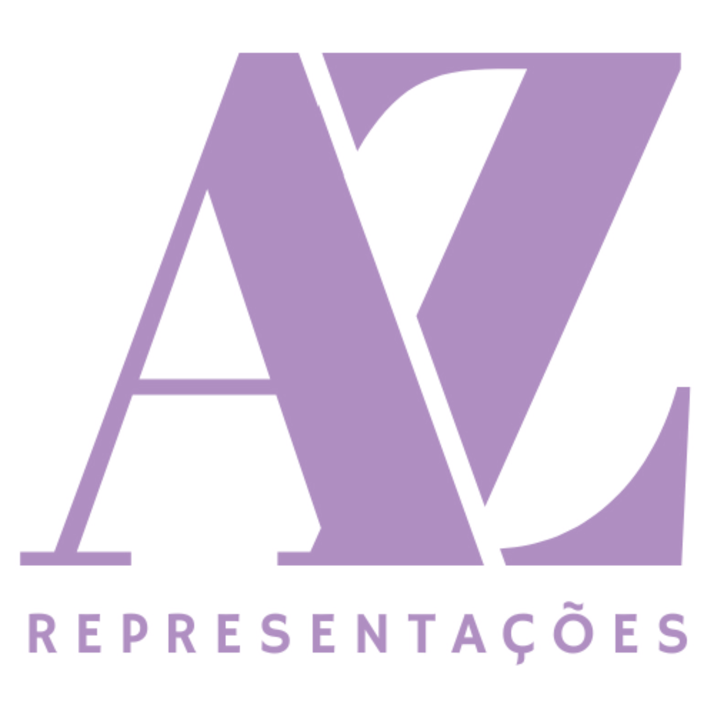

# AZ Representações

**Representação comercial de mobiliário de alto padrão**

[**› Acessar o site**](https://thqms.github.io/AZ-Landing-Page/)

---

Landing page institucional da **AZ Representações** — uma experiência de página única com estética de *galeria noturna*: paleta escura, tipografia editorial e movimento refinado. O site apresenta a empresa e as fábricas que ela representa, convidando lojistas e projetistas ao contato.

## Destaques

- 🌙 **Tema claro/escuro** com transição suave e um lustre que acende ao entrar no modo escuro
- 🖼️ **Carrossel de ambientes em tela cheia** (estilo galeria), com crossfade e navegação por gestos
- ✨ **Aurora animada** ao fundo e microinterações em todo o percurso
- 📱 **Totalmente responsivo** e otimizado para leveza (sem etapa de build no servidor)
- 💬 **Contato direto** por WhatsApp e Instagram

## Marcas representadas

ADM · Bux · Century · Iummi · Ponto Vírgula · Schuster · Tumar

## Feito com

React · CSS · [Lenis](https://github.com/darkroomengineering/lenis) (scroll suave) — JSX pré-compilado com [esbuild](https://esbuild.github.io/), servido como site estático no GitHub Pages.

---

**AZ Representações** · [@az_representacoes](https://www.instagram.com/az_representacoes/)

© 2026 — Todos os direitos reservados. Ver [LICENSE](LICENSE).

